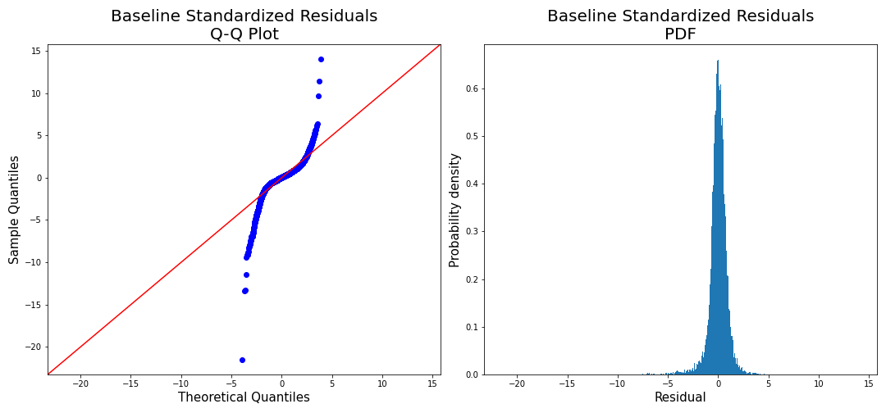

# Predicting House Prices in King County, Washington
Andre Yu Tiamco, Cameron De Arman
## Overview
In this project, we were tasked with taking a database of over 21,500 home sales in King county, Washington and creating a model to predict the sale price. The database provided contained various features of varying levels of usefulness, including the numbers of floors, bedrooms,  and bathrooms; square footage measurements including living space, lot, and basement; and even such things as latitude, longitude, and zipcode. The top 4 features to correlate with price are as follows:

## The Baseline Model
Upon recieving the data, we cleaned it. Afterward, we created a baseline linear regression model without performing any additional transformations or feature engineering (aside from one-hot encoding certain features). The following are the results for this model, which had an R-squared of around 0.73:
### Predictions vs Actual

As you can see, the baseline had decent predictive power, but still was not accounting for some factors. This leads to its highly conical shape.
### Residuals Analysis

The residuals for this model are far from normally distributed.
## Feature Engineering and Selection
After creating the baseline model, several features were added, and several quirks of the data were addressed (e.g. a house that was sold before it was built). Zipcode turned out to be massively useful, as [this site](https://www.bestplaces.net/) was able to connect any given zipcode to such numbers as median age, median income, and even median price of homes. Other features that were engineered include bathrooms/bedroom, a distance metric (see notebook for more detail), and binned versions of several categorical variables that were only then one-hot encoded.

The dataframe was then transformed using Sci-kit Learn's `PolynomialFeatures` object, adding in all possible multiplications of two variables as new columns. Selecting features from this massive (1000+ column) dataframe was performed with three selection algorithms, which iteratively selected features to optimize three different measurements: R-squared, RMSE of the target, and RMSE of the log-transformed target.
## Final Models
### Prediction vs Actual

These models perform much better than the baseline.
### Residuals Analysis

Again, these residuals are much more normal than the baseline model.
### Metrics
The three models had extremely similar metrics. As such, the y-axes on the following graphs are zoomed in:

Here are the actual numbers. Note that the R-squared maximization model likely only performed best because it was allowed to run for longest (and thus was able to select the most features).

## Conclusion
Each of the three methods of feature selection performed very similarly. The resulting models are able to explain around 88% (R-squared value) of the variations in the target. The differences likely arise from how long the selection algorithms were allowed to run, as the best-performing model (R-squared maximization) had the most features, and the worst performing model (RMSE minimization) had the fewest features.
## Repository Structure
├──data              Contains original data as well as transformations made in the process  
├──images            Contains all images, programatic and otherwise
├──notebooks         Contains final notebook for project, as well as the exploratory notebooks for each team member  
   ├──exploratory  
      ├──Andre  
      ├──Cameron  
└── README            README for viewers of this project